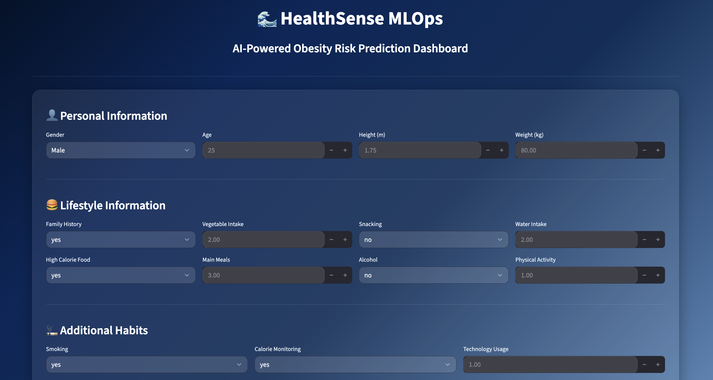
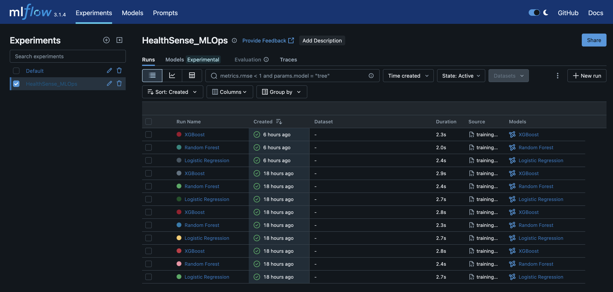
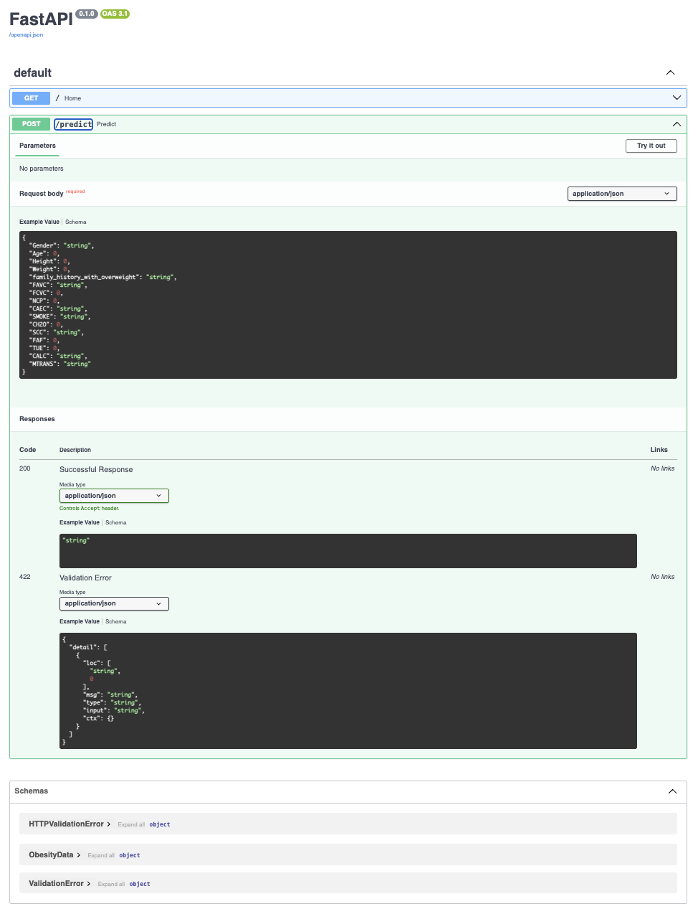

# HealthSense-MLOps

## End-to-End Production-Grade MLOps Pipeline for Obesity Risk Prediction

HealthSense-MLOps is a modular, production-oriented machine learning system designed to predict obesity risk categories using scalable MLOps practices. The project demonstrates the complete machine learning lifecycle including data ingestion, preprocessing, model training, experiment tracking, inference APIs, Dockerized deployment, DVC-based dataset versioning, CI/CD integration, and an interactive Streamlit dashboard.

This project was built to simulate real-world ML engineering workflows and production AI deployment pipelines.

---

# Dashboard Preview



---

# MLflow Experiment Tracking



---

# Swagger API Documentation



---

# Project Highlights

- End-to-end modular ML pipeline
- Automated data ingestion and preprocessing
- Multi-model training and evaluation
- Experiment tracking with MLflow
- FastAPI inference service
- Dockerized deployment
- DVC dataset versioning
- Artifact management and reusable preprocessing
- Logging and custom exception handling
- GitHub Actions CI pipeline
- Premium Streamlit dashboard UI
- Production-style project architecture

---

# Tech Stack

| Category | Tools |
|---|---|
| Programming | Python |
| ML Frameworks | Scikit-learn, XGBoost |
| API Framework | FastAPI |
| Experiment Tracking | MLflow |
| Data Versioning | DVC |
| Containerization | Docker |
| CI/CD | GitHub Actions |
| Frontend | Streamlit |
| Data Processing | Pandas, NumPy |
| Model Serialization | Pickle |
| Visualization | Swagger UI |

---

# System Architecture

```text
                    ┌────────────────────┐
                    │   Raw Dataset      │
                    └─────────┬──────────┘
                              │
                              ▼
                    ┌────────────────────┐
                    │ Data Ingestion     │
                    └─────────┬──────────┘
                              │
                              ▼
                    ┌────────────────────┐
                    │ Data Transformation│
                    │ Encoding + Scaling │
                    └─────────┬──────────┘
                              │
                              ▼
                    ┌────────────────────┐
                    │ Model Training     │
                    │ LR / RF / XGBoost  │
                    └─────────┬──────────┘
                              │
                              ▼
                    ┌────────────────────┐
                    │ MLflow Tracking    │
                    └─────────┬──────────┘
                              │
                              ▼
                    ┌────────────────────┐
                    │ Model Evaluation   │
                    └─────────┬──────────┘
                              │
                              ▼
                    ┌────────────────────┐
                    │ Saved Artifacts    │
                    │ Model + Encoder    │
                    └─────────┬──────────┘
                              │
                              ▼
                    ┌────────────────────┐
                    │ FastAPI Inference  │
                    └─────────┬──────────┘
                              │
                              ▼
                    ┌────────────────────┐
                    │ Streamlit Frontend │
                    └─────────┬──────────┘
                              │
                              ▼
                    ┌────────────────────┐
                    │ Docker Deployment  │
                    └────────────────────┘
```

---

# Project Structure

```text
HealthSense_MLOps/
│
├── src/
│   ├── api/                # FastAPI application
│   ├── config/             # YAML configuration files
│   ├── data/               # Data ingestion & transformation
│   ├── model/              # Model training & evaluation
│   ├── pipelines/          # Training & prediction pipelines
│   ├── monitoring/         # Monitoring utilities
│   ├── schema/             # Data schemas
│   └── utils/              # Logger & exception handling
│
├── artifacts/              # Saved models & preprocessors
├── assets/                 # README screenshots
├── data/                   # Raw & processed datasets
├── logs/                   # Training and pipeline logs
├── mlruns/                 # MLflow tracking artifacts
├── notebooks/              # Experiment notebooks
├── reports/                # Evaluation reports
├── tests/                  # Unit & integration tests
│
├── Dockerfile
├── requirements.txt
├── README.md
└── app.py
```

---

# Machine Learning Workflow

## 1. Data Ingestion
- Loads obesity dataset
- Splits train/test datasets
- Stores processed artifacts

## 2. Data Transformation
- Handles missing values
- Applies feature scaling
- Encodes categorical variables
- Saves preprocessing pipeline
- Saves label encoder

## 3. Model Training

The following models were trained and benchmarked:
- Logistic Regression
- Random Forest
- XGBoost

The best-performing model is automatically selected and saved.

## 4. Experiment Tracking

MLflow is used for:
- model tracking
- experiment logging
- metric comparison
- artifact management

## 5. Model Evaluation

Automated evaluation reports are generated including:
- accuracy
- precision
- recall
- F1-score

## 6. Prediction Pipeline

Saved artifacts are loaded for inference:
- trained model
- preprocessor
- label encoder

## 7. FastAPI Deployment

Prediction service exposed through REST APIs.

## 8. Streamlit Frontend

Interactive healthcare dashboard for real-time obesity prediction.

---

# Modeling & Design Decisions

## Why These Features Were Used

The dataset contains medically relevant obesity predictors:

| Feature | Importance |
|---|---|
| Age | Metabolism changes with age |
| Height & Weight | Strong BMI-related obesity indicators |
| Family History | Captures genetic predisposition |
| High Calorie Food Consumption | Dietary obesity risk |
| Physical Activity | Calorie expenditure indicator |
| Water Intake | Metabolic regulation factor |
| Smoking & Alcohol | Lifestyle health indicators |
| Transportation Type | Sedentary vs active lifestyle |
| Technology Usage | Proxy for sedentary behavior |

---

## Why These Models Were Chosen

### Logistic Regression

Used as:
- interpretable baseline model
- fast linear benchmark
- comparison against ensemble methods

### Random Forest

Chosen because:
- handles nonlinear relationships
- robust to noise and outliers
- strong tabular data performance

### XGBoost

Chosen because:
- state-of-the-art boosting algorithm
- excellent tabular dataset performance
- handles complex feature interactions
- strong regularization support
- high predictive accuracy

XGBoost achieved the best performance (~95% accuracy).

---

## Why OneHotEncoding Was Used

Categorical variables were encoded using OneHotEncoder because:
- ML models require numerical inputs
- preserves categorical distinctions
- avoids ordinal assumptions

---

## Why StandardScaler Was Used

Feature scaling was applied because:
- Logistic Regression is sensitive to feature scale
- improves optimization convergence
- stabilizes training performance

---

## Why Train/Test Split Was Used

To:
- evaluate model generalization
- prevent overfitting
- simulate real-world unseen data inference

---

## Why MLflow Was Used

To:
- track experiments
- compare model performance
- improve reproducibility
- manage artifacts systematically

---

## Why DVC Was Used

To:
- version datasets
- track dataset evolution
- ensure reproducible ML pipelines

---

# Model Performance

| Model | Accuracy |
|---|---|
| Logistic Regression | ~87% |
| Random Forest | ~94% |
| XGBoost | ~95% |

---

# Installation

## Clone Repository

```bash
git clone https://github.com/NishuSingh28/HealthSense-MLOps.git
cd HealthSense-MLOps
```

---

## Create Virtual Environment

### macOS/Linux

```bash
python3 -m venv venv
source venv/bin/activate
```

### Windows

```bash
python -m venv venv
venv\Scripts\activate
```

---

## Install Dependencies

```bash
pip install -r requirements.txt
```

---

# Running The Training Pipeline

```bash
python -m src.pipelines.training_pipeline
```

This will:
- preprocess data
- train models
- track experiments
- save artifacts
- generate evaluation reports

---

# Running MLflow

```bash
mlflow ui
```

Open:

```text
http://127.0.0.1:5000
```

---

# Running FastAPI Server

```bash
uvicorn src.api.app:app --reload
```

Open Swagger documentation:

```text
http://127.0.0.1:8000/docs
```

---

# Sample Prediction Request

```json
{
  "Gender": "Male",
  "Age": 25,
  "Height": 1.75,
  "Weight": 80,
  "family_history_with_overweight": "yes",
  "FAVC": "yes",
  "FCVC": 2,
  "NCP": 3,
  "CAEC": "Sometimes",
  "SMOKE": "no",
  "CH2O": 2,
  "SCC": "no",
  "FAF": 1,
  "TUE": 1,
  "CALC": "Sometimes",
  "MTRANS": "Public_Transportation"
}
```

---

# Docker Deployment

## Build Docker Image

```bash
docker build -t healthsense-api .
```

---

## Run Docker Container

```bash
docker run -p 8000:8000 healthsense-api
```

---

# CI/CD Pipeline

GitHub Actions workflow automatically:
- installs dependencies
- validates project setup
- runs training pipeline

on every push to the `main` branch.

---

# Future Improvements

- Exploratory Data Analysis (EDA)
- Correlation analysis and multicollinearity handling
- Feature selection and importance analysis
- SHAP explainability integration
- Hyperparameter optimization
- Drift monitoring with Evidently AI
- Automated retraining pipelines
- Kubernetes deployment
- Cloud deployment on AWS/GCP
- Feature store integration
- Real-time inference monitoring

---

# Author

## Nishu Singh

GitHub: https://github.com/NishuSingh28
